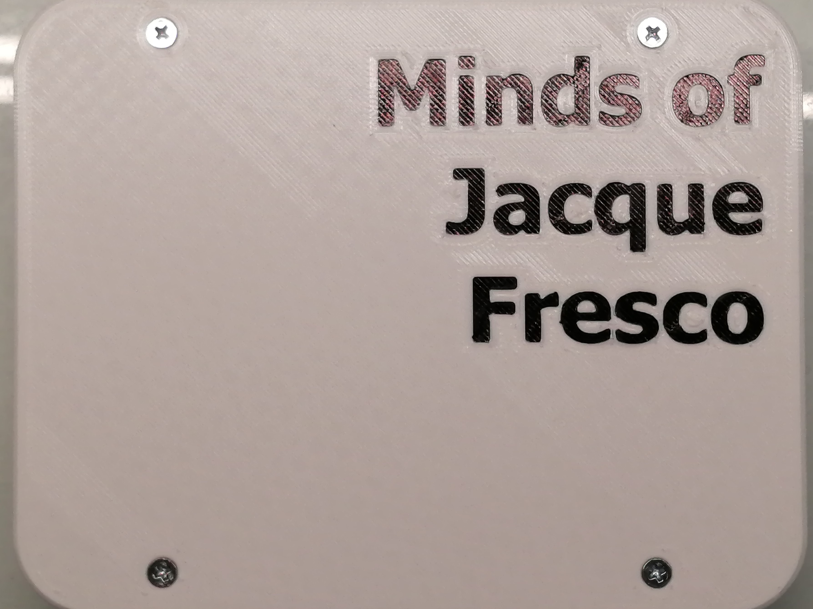
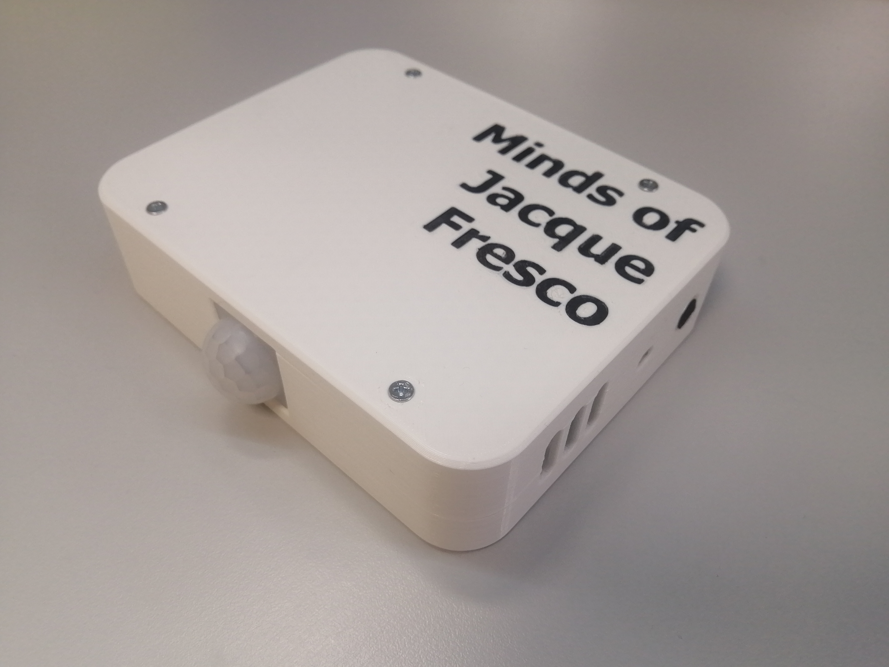

Предпрофессиональная олимпиада 2021, профиль Информационные Технологии, кейс №7 «Цифровой двойник устройства сбора данных с использованием дополненной реальности», код «железной» части (датчики и сервер), а также мобильное приложение.

Разработка мобильного приложения велась в среде Unity, поэтому проект занимает много места и имеет сложную файловую структуру. Его было решено загрузить на [Google диск](https://drive.google.com/drive/folders/1nJuXLxiyv37RzI8zHM_y-5xwtt_-yIpV).

В репозитории находится собранное мобильное приложение. Вы можете установить его на свой смартфон и проверить работоспособность. Показания датчиков скорее всего будут не актуальными, но хотя бы дополненная реальность будет функционировать.  
Для проверки достаточно навести камеру на эту картинку _[на момент января 2022 года приложение перестало отображать AR картинку из-за окончания действия тестовой лицензии сервиса vuforia]_: 

Демонстрация работы:

https://user-images.githubusercontent.com/78589729/177053630-744a4e1b-0a8c-4513-b667-495df930792a.mp4

Итоговый корпус выглядит лучше демо-варианта из картона:

